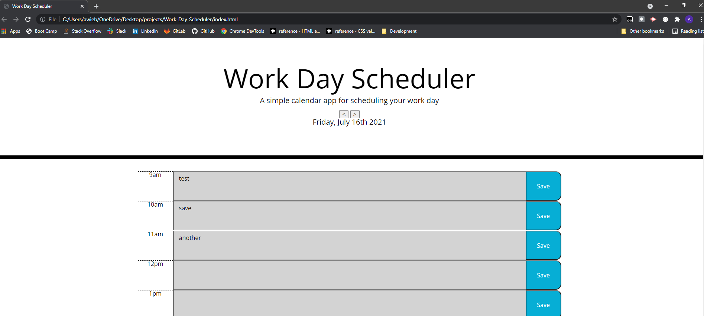

# Weather-Dashboard

## Description 

Server-Side APIs Challenge: Weather Dashboard
Challenge Elements
Third-party APIs allow developers to access their data and functionality by making requests 
with specific parameters to a URL. Developers are often tasked with retrieving data from 
another application's API and using it in the context of their own. Your challenge is to 
build a weather dashboard that will run in the browser and feature dynamically updated HTML and CSS.

## Installation

The project can be viewed at: https://AWiebe2021.github.io/Weather-Dashboard/
The projects code can be accessed at: https://github.com/AWiebe2021/Weather-Dashboard/

## Screenshot

## Credits
Solo project this sixth week